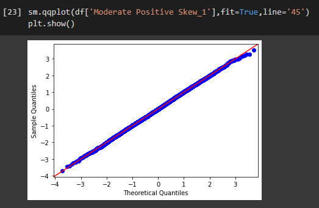
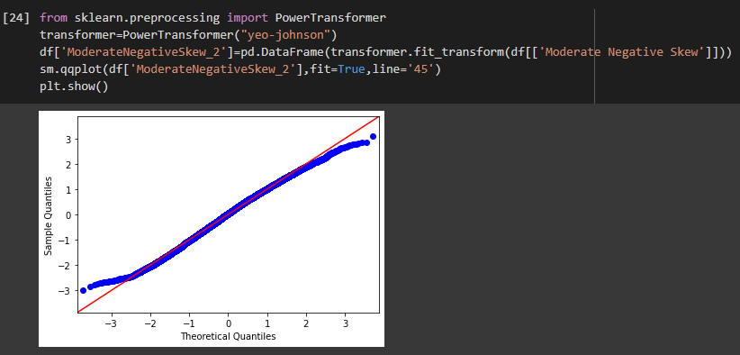

# Ex-06-Feature-Transformation
## Aim:
To read and perform feature selection for the given dataset.
## Explanation:
Feature transformation is a mathematical transformation in which we apply a mathematical formula to a particular column (feature) and transform the values, which are useful for our further analysis. It is a technique by which we can boost our model performance.
## Algorithm:
### STEP 1
Read the given Data

### STEP 2
Clean the Data Set using Data Cleaning Process

### STEP 3
Apply Feature Transformation techniques to all the features of the data set

### STEP 4
Save the data to the file
## Program:
Program developed by : Shrruthilaya G

Register numnber : 212221230097
```
import numpy as np
import pandas as pd
import matplotlib.pyplot as plt
import statsmodels.api as sm
import scipy.stats as stats

df = pd.read_csv("/content/Data_to_Transform.csv")
df

df.head()

df.isnull().sum()

df.info()

df.describe()

df1 = df.copy()

sm.qqplot(df['Highly Positive Skew'],fit=True,line='45')
plt.show()

sm.qqplot(df['Highly Negative Skew'],fit=True,line='45')
plt.show()

sm.qqplot(df['Moderate Positive Skew'],fit=True,line='45')
plt.show()

sm.qqplot(df['Moderate Negative Skew'],fit=True,line='45')
plt.show()

df['Highly Positive Skew'] = np.log(df['Highly Positive Skew'])

sm.qqplot(df['Highly Positive Skew'],fit=True,line='45')
plt.show()

df['Moderate Positive Skew'] = np.log(df['Moderate Positive Skew'])

sm.qqplot(df['Moderate Positive Skew'],fit=True,line='45')
plt.show()

df['Highly Positive Skew'] = 1/df['Highly Positive Skew']

sm.qqplot(df['Highly Positive Skew'],fit=True,line='45')
plt.show()

df['Highly Positive Skew'] = df['Highly Positive Skew']**(1/1.2)

sm.qqplot(df['Highly Positive Skew'],fit=True,line='45')
plt.show()

df['Moderate Positive Skew_1'], parameters=stats.yeojohnson(df['Moderate Positive Skew'])

sm.qqplot(df['Moderate Positive Skew_1'],fit=True,line='45')
plt.show()

from sklearn.preprocessing import PowerTransformer
transformer=PowerTransformer("yeo-johnson")
df['ModerateNegativeSkew_2']=pd.DataFrame(transformer.fit_transform(df[['Moderate Negative Skew']]))
sm.qqplot(df['ModerateNegativeSkew_2'],fit=True,line='45')
plt.show()

from sklearn.preprocessing import QuantileTransformer
qt = QuantileTransformer(output_distribution = 'normal')
df['ModerateNegativeSkew_2'] = pd.DataFrame(qt.fit_transform(df[['Moderate Negative Skew']]))
sm.qqplot(df['ModerateNegativeSkew_2'],fit=True,line='45')
plt.show()
```
## Output:
### Dataset:

### Head:

### Null data:

### Information:

### Description:

### Highly Positive Skew:

### Highly Negative Skew:

### Moderate Positive Skew:

### Moderate Negative Skew:

### Log of Highly Positive Skew:

### Log of Moderate Positive Skew:

### Reciprocal of Highly Positive Skew:

### Square root tranformation:

### Power transformation of Moderate Positive Skew:

### Power transformation of Moderate Negative Skew:

### Quantile transformation:

## Result:
Thus, Featuretransformation is performed and executed successfully for the given dataset.
